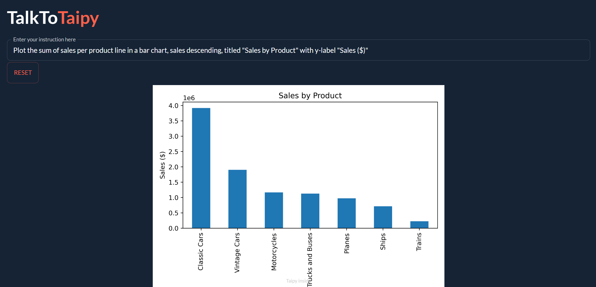

# TalkToTaipy

**Manipulate and visualize data with only natural language prompts.**

<p align="center">
  
</p>

## Usage:

- TalkToTaipy works with few-shot learning using PandasAI and StarCoder.
- Enter questions about the dataset, data manipulation, or plotting instructions in the text box, and the app will either display an answer, the modified dataset, or a plot.
- Press the reset button to reset the dataset to its original state.

## Setup

**Requires a Hugging Face API key in `app.py`** 

**Requires Python >= 3.9** 

[How to get your Hugging Face API key](https://huggingface.co/docs/hub/security-tokens#:~:text=To%20create%20an%20access%20token,you're%20ready%20to%20go!)

**1.** Clone the repo

```bash	
git clone https://github.com/AlexandreSajus/TaipyLLM.git
```

**2.** Install requirements one at a time (currently not working with `pip install -r requirements.txt` for compatibility reasons)

```bash
pip install taipy==2.3.1
```

```bash
pip install pandasai==0.6.12
```

**3.** Create a `secret.txt` text file next to `app.py` with your Hugging Face API key in it

**4.** Run `app.py`

```bash
python app.py
```